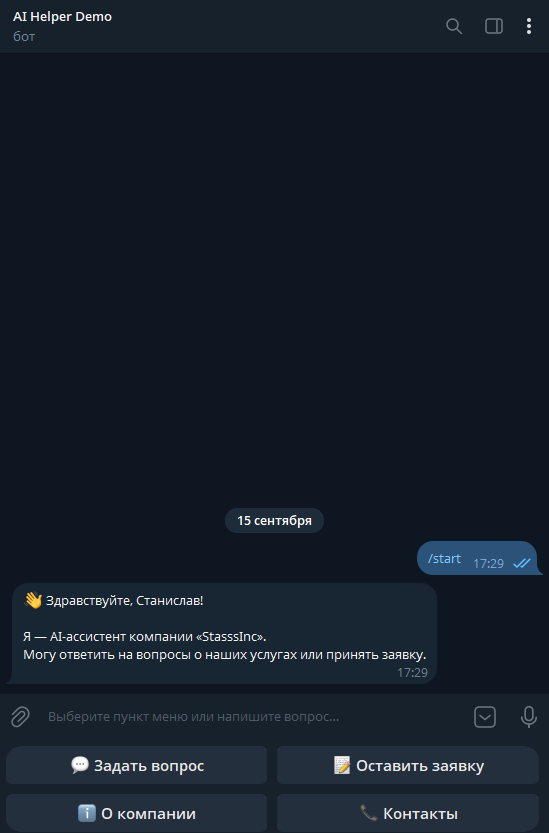
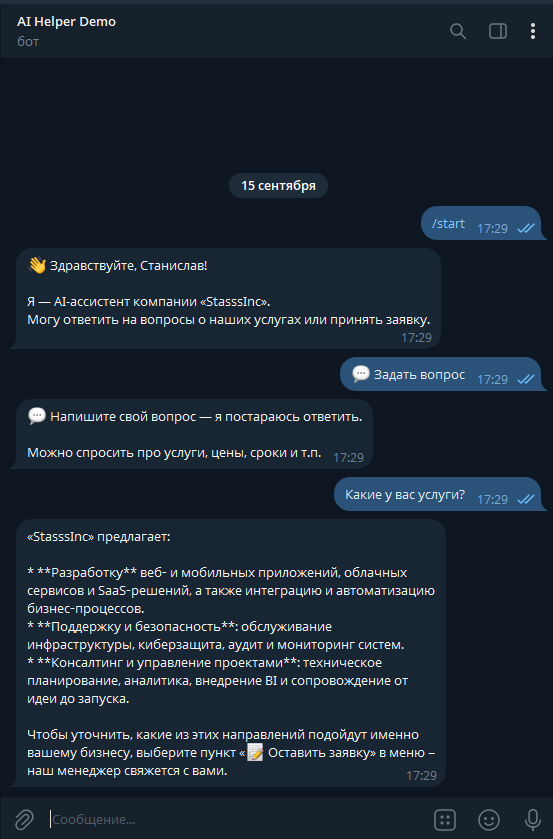
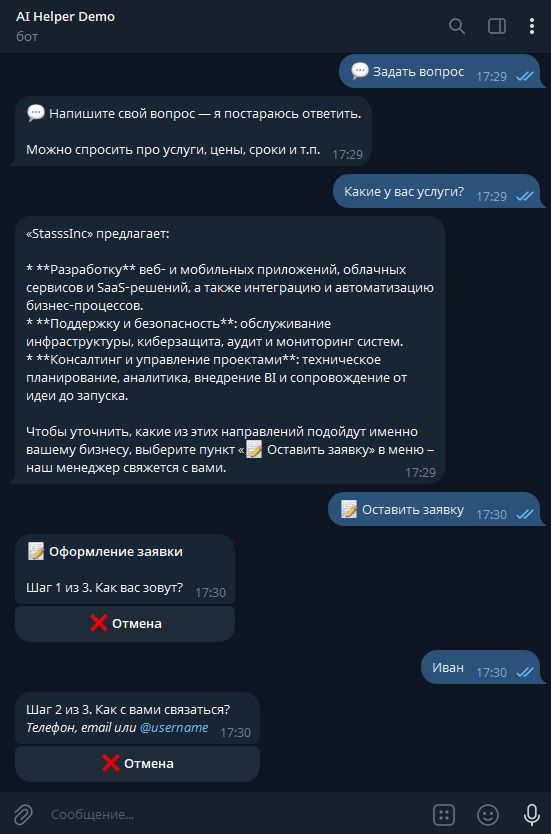
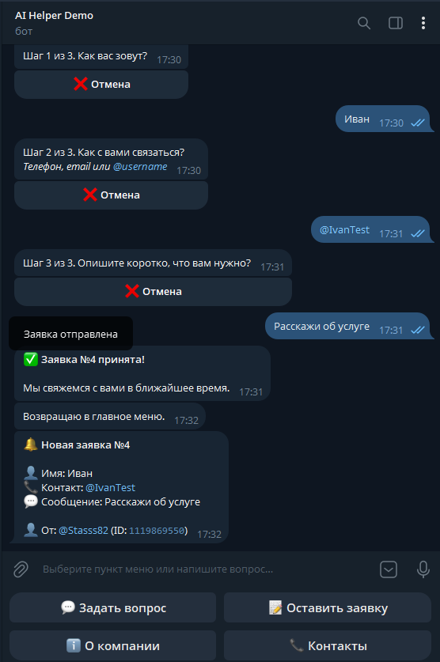

# 🤖 AI Helper Bot

Telegram-бот: AI-консультант с приёмом заявок и админ-панелью.


## ✨ Возможности

- 💬 **AI-консультант** — отвечает на вопросы клиентов через Groq (Llama 3.x) с сохранением контекста диалога
- 📝 **Приём заявок** — пошаговый FSM-сбор имени, контакта и описания задачи
- 🔔 **Мгновенные уведомления** — админ получает заявку в Telegram сразу после подтверждения
- 🛠 **Админ-панель** — статистика (пользователи, заявки, сообщения) и список последних заявок
- 💾 **SQLite** — вся база в одном файле, без сервера БД
- 📊 **Логирование** — в консоль и файл `bot.log`
- 🔐 **Разделение ролей** — обычные пользователи и админ

## 🧱 Стек

| Слой | Технология |
|---|---|
| Telegram | aiogram 3.x (async) |
| AI | Groq API (OpenAI-совместимый) |
| БД | SQLite через aiosqlite |
| Конфиг | python-dotenv |
| Логи | logging + файл |

## 📸 Скриншоты

| Главное меню | AI-диалог |
|---|---|
|  |  |

| Оформление заявки | Админ-панель |
|---|---|
|  |  |

## 🚀 Установка и запуск

```bash
git clone https://github.com/yourusername/ai-helper-bot.git
cd ai-helper-bot
python -m venv .venv
source .venv/bin/activate  # Windows: .venv\Scripts\activate
pip install -r requirements.txt
cp .env.example .env
# заполни .env — см. таблицу ниже
python main.py
```

## ⚙️ Переменные окружения

| Ключ | Обязательно | Описание |
|---|---|---|
| `BOT_TOKEN` | ✅ | токен от [@BotFather](https://t.me/BotFather) |
| `OPENAI_API_KEY` | ✅ | ключ Groq ([console.groq.com](https://console.groq.com)) |
| `OPENAI_BASE_URL` | ✅ | `https://api.groq.com/openai/v1` |
| `OPENAI_MODEL` | ✅ | `openai/gpt-oss-120b` |
| `ADMIN_ID` | ⬜ | твой Telegram ID (узнать: [@userinfobot](https://t.me/userinfobot)) |
| `COMPANY_NAME` | ⬜ | название компании для промпта AI |

## 📁 Структура проекта

```
ai-helper-bot/
├── handlers/
│   ├── __init__.py    # сборка роутеров
│   ├── user.py        # пользовательские хендлеры (AI, FSM, меню)
│   └── admin.py       # админ-панель
├── config.py          # чтение .env, константы
├── database.py        # SQLite: users, leads, messages
├── keyboards.py       # reply- и inline-клавиатуры
├── ai.py              # клиент Groq/OpenAI
├── main.py            # точка входа
├── requirements.txt
└── .env.example
```

## 🎯 Что можно добавить дальше

- [ ] Docker + docker-compose
- [ ] Redis для FSM (переживает рестарт бота)
- [ ] Rate limiting (защита от спама)
- [ ] Календарь записи (inline)
- [ ] Оплата через Telegram Stars
- [ ] Мультиязычность (aiogram-i18n)
- [ ] Веб-админка на FastAPI

## 📄 Лицензия

MIT — используй свободно.